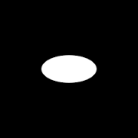
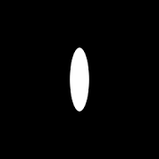
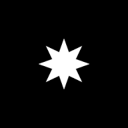
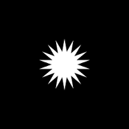
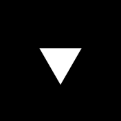
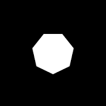
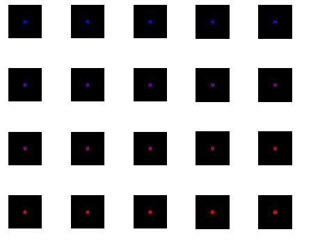
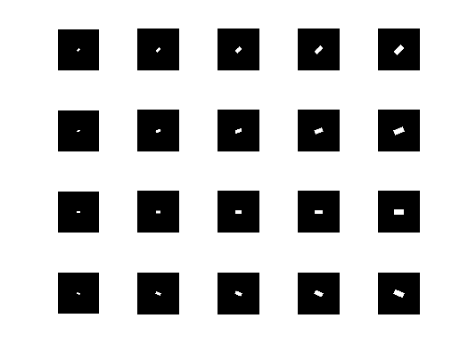

# 2D Shape Generator

A highly customisable generator for parametrically varied 2D shapes. Useful for psychological experiments and proof-of-concept Machine Learning simulations.  
The generator returns single .png files for each generated image, as well as a MATLAB .mat file in which all images are stored as uint8 matrices, together with a copy of all parameters and labels for each image.   

## How to use
If you run the script  

    python main.py  

a few demo shapes with default settings will be generated and stored in your project folder as .png files. 

All settings are defined in the main.py file via argparse flags. Therefore, the user can easily specify parameters as command line arguments without having to mess with python code.  

## Examples

#### 1. Single Shapes

    python main.py --shapes ellipse && python main.py --shapes ellipse --stim_ellipse_ratio 0.3 1.2

    python main.py --shapes star5 star8 star18

    python main.py --shapes poly3 poly5 poly7

#### 2. A simple Colour Gradient
    
    python main.py --shapes star5 --to_transform colour --num_transformations 20
creates 20 stars with fie vertices, parametrically varied in colour from red to blue  

#### 3. Cartesian Product of Rotation and Scale
    python main.py --shapes rect --to_transform scale rota --num_transformations 5
creates a 5 by 5 grid of rectangles, with parametrically varied scale and rotation

## Parameters
The following parameters can be changed from the command line to customise the stimuli

    --outdir                    output directory
    --name                      file name

    --canvas_size               size of image [px]
    --canvas_bccol              background colour [r g b]    

    --num_stimuli               number of stimuli per shape (duplicates)
    --num_transformations       number of linearly spaced transformations
    --shapes                    shapes to generate
    --to_transform              dimensions to transform

    --stim_poly_size            default size of polygon
    --stim_star_size            default size of star
    --stim_rect_ratio           default width to height for rectangles
    --stim_ellipse_ratio        default width to height for ellipses
    
    --stim_scale                default width and height scale 
    --stim_rota                 default rotation
    --stim_trx                  default translation along x 
    --stim_try                  default translation along y 
    --stim_colour               default colour [r g b]

    --rng_scale                 range of scale transformation
    --rng_trx                   range of translation along x
    --rng_try                   range of translation along y
    --rng_rota                  range of rotation transformation

## Notes
On Unix or MacOS, you should install **libcairo2** and **libcairo2-dev**.
